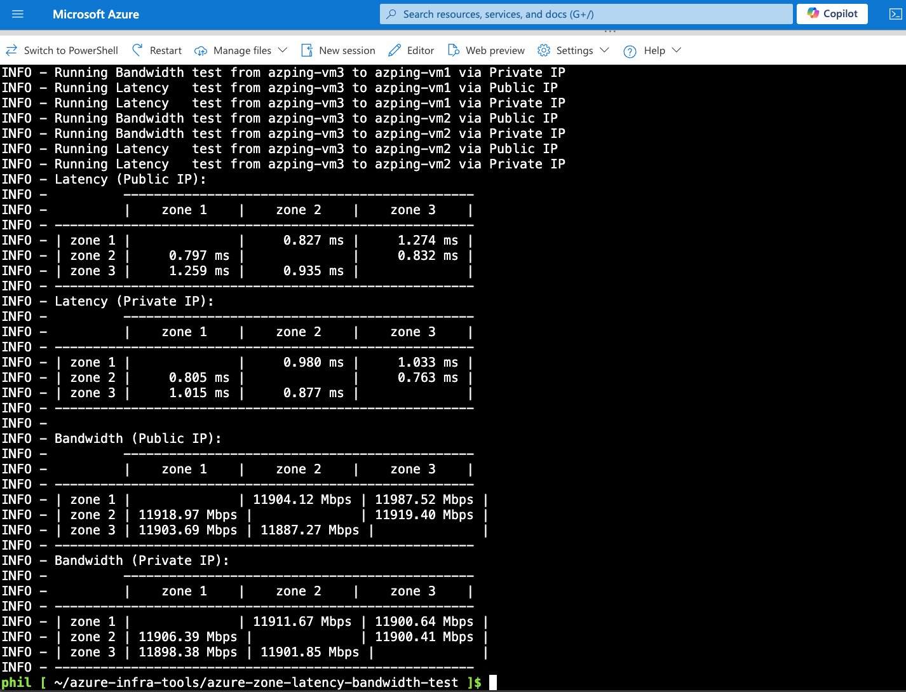

> ## Changes in this fork
>
> This version was modified to make the tool private-network only and to enable Serial Console. Summary of changes:
>
> - **Private IPs only:** VMs are created without public IPs. Public IP creation and the `get_public_ip_address` helper were removed; VM creation now returns the private IP.
> - **Private-IP tests only:** All `iperf3`/`sockperf` tests and SSH connections now target private IPs. The "Public IP" test paths and result tables were removed.
> - **Controller model:** The script should be run from a **controller** machine with direct VNet connectivity, authenticating via **system-assigned managed identity** (`DefaultAzureCredential`). Azure CLI (`az login --identity`) is still used for subscription lookup. This eliminates challenges to reach out to VMs from your computer.
> - **Tightened NSG:** All inbound rules (SSH, iperf3, sockperf, two-ping, asn, icmp) now allow traffic only from the `VirtualNetwork` service tag instead of `*`.
> - **Managed boot diagnostics:** VMs enable boot diagnostics with a **Microsoft-managed** storage account (no `storage_uri`), enabling Serial Console without provisioning a customer storage account.
> - **No storage accounts:** The tool does not create or use any Azure Storage account; the only VM `storage_profile` is the OS-disk image reference.
> - **Build dependencies for `cffi`:** `install.sh` now installs the system prerequisites needed when `cffi` (a `cryptography`/`PyNaCl` dependency) has to be compiled from source — a C compiler (`build-essential`/`gcc`), `libffi` headers, and the matching Python development headers (`python<version>-dev`, falling back to `python3-dev`). This avoids the `fatal error: Python.h: No such file or directory` build failure, which happens on Python versions that lack prebuilt `cffi` wheels. Supports apt, dnf, and yum based distros.
> - **Graceful missing-resource handling:** `get_private_ip_address` now catches `ResourceNotFoundError` and logs an actionable message (create the infrastructure first) instead of crashing with a stack trace when `--run`/`--show-info` is used before the VMs exist.

# Azure Zone Latency/Bandwidth Test

This script is designed to test latency and bandwidth between virtual machines (VMs) in different availability zones within an Azure region. It automates the creation of resource groups, virtual networks, network security groups, and VMs, and then runs latency and bandwidth tests using `iperf3` and `sockperf`.

The VMs are created with **private IPs only** (no public IPs). All tests run over the private IPs. The script must therefore run from a **controller** machine that already has direct network connectivity to the VNet (for example, a VM inside the same or a peered VNet). The controller authenticates to Azure using its **system-assigned managed identity** via `DefaultAzureCredential`.



## Prerequisites

- A **controller VM inside the VNet** (or a peered VNet / VPN / ExpressRoute) with direct line-of-sight to the test VMs' private IPs. You provision this yourself.
- The controller's **system-assigned managed identity** granted a role that can create resources in the target resource group/subscription (e.g. Contributor).
- Python 3.9 or higher
- Azure CLI (used for subscription lookup; sign in with `az login --identity` on the controller)
- Azure SDK for Python
- `paramiko` library for SSH connections

## Installation

1. Open Cloud Shell or your own local terminal

   ```sh
   https://shell.azure.com
   ```
2. Clone the repository:

   ```sh
   git clone https://github.com/pichuang/azure-infra-tools.git
   cd azure-infra-tools/azure-zone-latency-bandwidth-test
   ```
3. Install the required Python packages:

   ```sh
   bash ./install.sh
   # Or
   # pip install -r requirements.txt
   ```
4. Ensure you are logged in to Azure CLI:

   ```sh
   # On the controller VM, sign in with its system-assigned managed identity
   az login --identity
   # Or, interactively
   # az login --tenant <your-tenant-id> --use-device-code
   ```

## Usage

### Command Line Arguments

- `--tenant`: Azure Tenant ID or Name (optional)
- `--subscription`: Azure Subscription ID (required)
- `--resource-group-name`: Resource Group Name (required)
- `--vm-type`: VM Type (default: `Standard_D8lds_v5`)
- `--location`: Azure Region (default: `southeastasia`)
- `--enable-accelerated-networking`: Enable Accelerated Networking (default: `True`)
- `--admin-username`: Admin username for the VM (default: `repairman`)
- `--admin-password`: Admin password for the VM (default: `xxxxxxxxxxxxxx`)
- `--network-cidr`: Network CIDR (default: `192.168.100.0/24`)
- `--force-delete`: Force delete the resource group (optional)
- `--run`: Run latency and bandwidth tests directly (optional)
- `--show-info`: Show VM info (IP, username, password) (optional)
- `--skip-bandwidth-test`: Skip bandwidth tests (optional)
- `--skip-latency-test`: Skip latency tests (optional)

### Examples

1. **Create Resources and Run Tests:**

   ```sh
   ./azure-zone-latency-bandwidth-test.py --subscription <your-subscription-id> --resource-group-name rg-hello-sea
   ```

   Output:

   ```sh
   phil [ ~/azure-infra-tools/azure-zone-latency-bandwidth-test ]$ ./azure-zone-latency-bandwidth-test.py --subscription xxxxxxxx-xxxx-xxxx-xxxx-xxxxxxxxxxxx --resource-group-name rg-hello-sea
   INFO - Resource group rg-hello-sea has been created.
   INFO - VNet azping-mgmt-vnet has been created.
   INFO - Subnet default has been created.
   INFO - Network security group azping-nsg has been created.
   INFO - VM azping-vm1 has been created.
   INFO - VM azping-vm2 has been created.
   INFO - VM azping-vm3 has been created.
   INFO - All VMs created. Checking network reachability...
   INFO - Checking if VMs are reachable...
   ...omitted...
   ```
2. **Show VM Information:**

   ```sh
   ./azure-zone-latency-bandwidth-test.py --subscription <your-subscription-id> --resource-group-name rg-hello-sea --show-info
   ```

   Output:

   ```
   phil [ ~/azure-infra-tools/azure-zone-latency-bandwidth-test ]$ ./azure-zone-latency-bandwidth-test.py --subscription xxxxxxxx-xxxx-xxxx-xxxx-xxxxxxxxxxxx --resource-group-name rg-hello-sea --show-info
   INFO - VM Name: azping-vm1, Private IP: a.a.a.a, Username: repairman, Password: xxxxxxxxxxxxxx
   INFO - To login azping-vm1 from a controller inside the VNet: expect -c 'spawn ssh repairman@a.a.a.a; expect "password:"; send "xxxxxxxxxxxxxx\r"; interact'
   INFO - VM Name: azping-vm2, Private IP: b.b.b.b, Username: repairman, Password: xxxxxxxxxxxxxx
   INFO - To login azping-vm2 from a controller inside the VNet: expect -c 'spawn ssh repairman@b.b.b.b; expect "password:"; send "xxxxxxxxxxxxxx\r"; interact'
   INFO - VM Name: azping-vm3, Private IP: c.c.c.c, Username: repairman, Password: xxxxxxxxxxxxxx
   INFO - To login azping-vm3 from a controller inside the VNet: expect -c 'spawn ssh repairman@c.c.c.c; expect "password:"; send "xxxxxxxxxxxxxx\r"; interact'
   ```
3. **Force Delete Resource Group:**

   ```sh
   ./azure-zone-latency-bandwidth-test.py --subscription <your-subscription-id> --resource-group-name rg-hello-sea --force-delete
   ```

   Output:

   ```sh
   phil [ ~/azure-infra-tools/azure-zone-latency-bandwidth-test ]$ ./azure-zone-latency-bandwidth-test.py --subscription xxxxxxxx-xxxx-xxxx-xxxx-xxxxxxxxxxxx --resource-group-name rg-hello-sea --force-delete
   INFO - Resource group rg-hello-sea deletion initiated, No need to wait for the deletion to complete
   ```
4. **Run All Tests Directly:**

   ```sh
   ./azure-zone-latency-bandwidth-test.py --subscription <your-subscription-id> --resource-group-name rg-hello-sea --run
   ```

   Output:

   ```sh
   phil [ ~/azure-infra-tools/azure-zone-latency-bandwidth-test ]$ ./azure-zone-latency-bandwidth-test.py --subscription 0a4374d1-bc72-46f6-a4ae-a9d8401369db --resource-group-name rg-hello-sea --run
   INFO - Private IP address for azping-vm1: a.a.a.a
   INFO - Private IP address for azping-vm2: b.b.b.b
   INFO - Private IP address for azping-vm3: c.c.c.c
   INFO - Running Bandwidth test from azping-vm1 to azping-vm2 via Private IP
   INFO - Running Latency   test from azping-vm1 to azping-vm2 via Private IP
   INFO - Running Bandwidth test from azping-vm1 to azping-vm3 via Private IP
   INFO - Running Latency   test from azping-vm1 to azping-vm3 via Private IP
   ...omitted...
   ```
5. **Run Only Bandwidth Tests:**

   ```sh
   ./azure-zone-latency-bandwidth-test.py --subscription <your-subscription-id> --resource-group-name rg-zone-test --skip-latency-test
   ```

## Output

The script will log the following information:

- Creation status of resource groups, virtual networks, network security groups, and VMs.
- Private IP addresses of the VMs.
- Results of latency and bandwidth tests between the VMs (private IP only).

## Notes

- **Private IPs only:** VMs are created without public IPs, and every test targets private IPs. Run the script from a controller with direct VNet connectivity.
- **Networking:** The NSG allows the SSH and test ports (iperf3 `5201`, sockperf `11111`, etc.) inbound only from the `VirtualNetwork` service tag, not the internet.
- **No storage accounts:** The script does not create or use any Azure Storage account. The only `storage_profile` on each VM is the OS-disk image reference (an implicit managed disk); there is no blob, file, queue, or table usage.
- Ensure that the provided admin username and password meet Azure's security requirements.
- The script assumes that the `iperf3` and `sockperf` tools are available on the VMs. The script will attempt to install these tools if they are not already present.
- The script uses `paramiko` for SSH connections to the VMs over their private IPs. Ensure the controller can reach the VNet and that the NSG allows SSH from within the VNet.

## License

This project is licensed under the MIT License. See the [LICENSE](../LICENSE) file for details.
